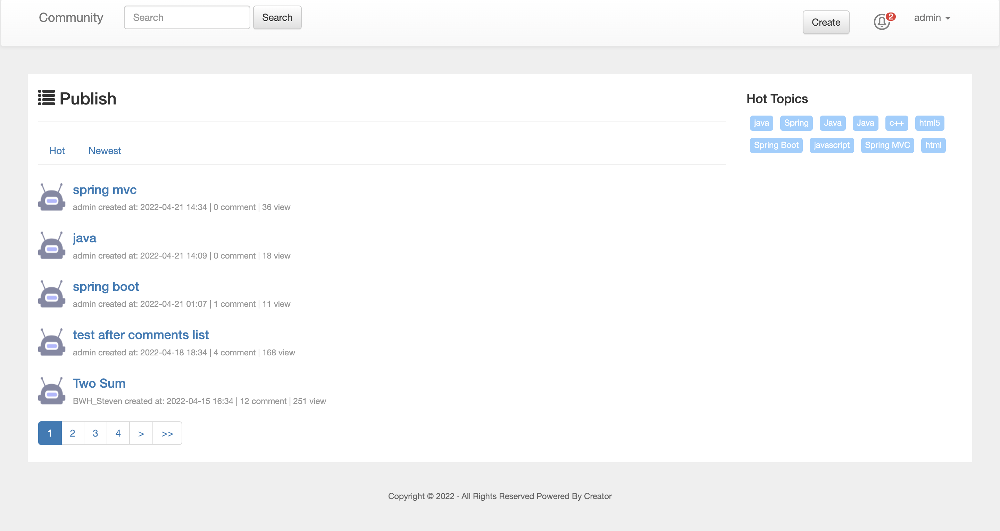

## Community


## Execute
```sh
java -jar target/community-0.0.1-SNAPSHOT.jar
```
address: http://localhost:8887/

## Technology stack
|  Technology   | Function | Link   |   
| ---- | ---- | ---- |  
|  Spring Boot  | Spring platform | https://spring.io/projects/spring-boot  |
|  Mysql  | Database  | https://spring.io/guides/gs/accessing-data-mysql/   |
|  MyBatis  | An open source persistence framework which simplifies the implementation of database access in Java applications.  | https://mybatis.org/mybatis-3/index.html   |
|  Apache Shiro  | Java security framework that performs authentication, authorization, cryptography, and session management. |  https://shiro.apache.org/spring-boot.html   |
|  Bootstrap  | HTML, CSS, and JS framework. |  https://v3.bootcss.com/getting-started/|
|  Thymeleaf  | Java template engine for processing and creating HTML, XML, JavaScript, CSS and text. |  https://www.thymeleaf.org/  |
|  thymeleaf-extras-shiro  | A Thymeleaf dialect for Apache Shiro tags. |  https://github.com/theborakompanioni/thymeleaf-extras-shiro  |
|  Lombok  |  Java library tool, that automatically plugs into your editor and build tools (e.g. getter and setter) |https://www.projectlombok.org |
|  Apache Commons Lang |  A package of Java utility classes, extending the functionality of the Java API |  https://commons.apache.org/proper/commons-lang/   |
|  MyBatis Generator |  MyBatis Generator (MBG) is a code generator for MyBatis MyBatis, generate code for all versions of MyBatis.  |  http://mybatis.org/generator/   |
|  MyBatisCodeHelperPro |  Intellij Plugin for Mybatis, Type safe sql support, plugin can recognize mybatis dynamic sql |  https://plugins.jetbrains.com/plugin/9837-mybatiscodehelperpro   |
|  PageHelper  |  MyBatis Pagination |  https://github.com/pagehelper/Mybatis-PageHelper
|  Markdown plugin  |  Markdown editor   |    http://editor.md.ipandao.com/en.html
|  ELK    | ElasticSearch + Logstash + Kibana | https://www.elastic.co/what-is/elk-stack
|  RabbitMq    |  An open-source message-broker software   |   https://www.rabbitmq.com/


## Extended materials
[ Spring ](https://spring.io/guides)    
[ Spring MVC ](https://docs.spring.io/spring/docs/5.0.3.RELEASE/spring-framework-reference/web.html#mvc-handlermapping-interceptor)  
[ Spring Web ](https://spring.io/guides/gs/serving-web-content/)   
[ Spring Boot Embedded Database Support ](https://docs.spring.io/spring-boot/docs/2.0.0.RC1/reference/htmlsingle/#boot-features-embedded-database-support)      
[ Spring Dev Tool ](https://docs.spring.io/spring-boot/docs/2.0.0.RC1/reference/htmlsingle/#using-boot-devtools)   
[ Thymeleaf](https://www.thymeleaf.org/doc/tutorials/3.0/usingthymeleaf.html#setting-attribute-values)   
[ Live Reload](https://chrome.google.com/webstore/detail/livereload/jnihajbhpnppcggbcgedagnkighmdlei/related)    
[ UFfile SDK](https://github.com/ucloud/ufile-sdk-java)      
[ Git](https://git-scm.com/download)      
[ Flyway](https://flywaydb.org/getstarted/firststeps/maven)  
[ ctotree](https://www.octotree.io/)    
[ Postman](https://chrome.google.com/webstore/detail/coohjcphdfgbiolnekdpbcijmhambjff)   
[H2](http://www.h2database.com/html/main.html)     


## Notes
1. the import order of css and js in HTML
2. when using mybatis, still set default value during service layer (error: insert null when setting default value)
3. Html file: image path; class may be covered
4. Shiro: not need to write "/logout"; the subclass of AuthenticationException; the content of SimpleAuthenticationInfo (UserRealm): getPrincipal()
5. Pagination: page and size boundary
6. MyBatis Generator: config; must same property type 
7. Error Handling: custom ErrorController (Customized Exception). use regular Spring MVC features such as @ExceptionHandler methods and @ControllerAdvice. The ErrorController(CustomizedExceptionHandler) then picks up any unhandled exceptions.
8. Logging: specify log setting in application.properties. https://docs.spring.io/spring-boot/docs/current/reference/html/features.html#features.logging
9. scheduling task: https://spring.io/guides/gs/scheduling-tasks/
   update rate: (fixedRate = 1000 * 60 * 60 * 3) priority = postCount * 5 + commentCount   Top N
10. ELK: search posts, which is faster than mysql
11. RabbitMq: used for message queue


## Questions
1. file upload (locally), ucloud sdk
2. search + sort, since search is in the navigation


## generate mybatis mapper file
```bash
mvn -Dmybatis.generator.overwrite=true mybatis-generator:generate
```


